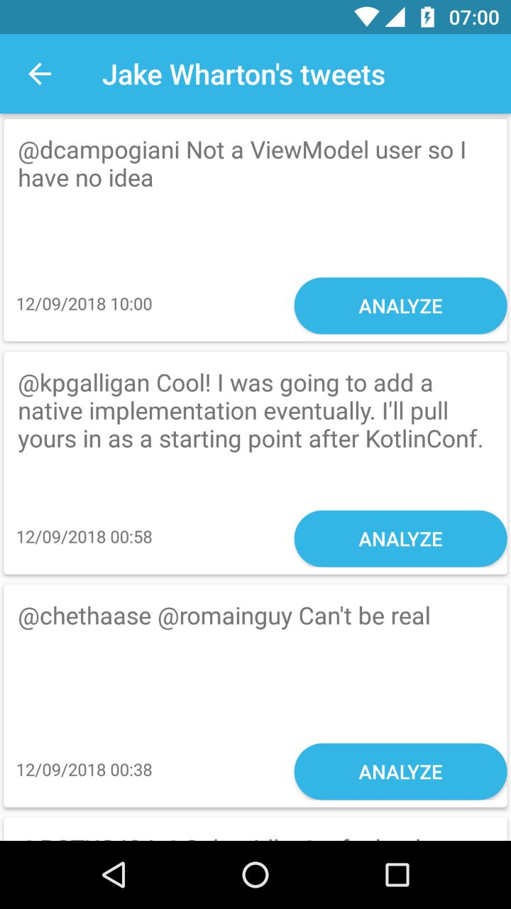

# ifood-mobile-test
Create an app that given an Twitter username it will list user's tweets. When I tap one of the tweets the app will visualy indicate if it's a happy, neutral or sad tweet.

## Business rules
* Happy Tweet: We want a vibrant yellow color on screen with a 😃 emoji
* Neutral Tweet: We want a grey colour on screen with a 😐 emoji
* Sad Tweet: We want a blue color on screen with a 😔 emoji
* For the first release we will only support english language

### Hints
* You may use Twitter's oficial API (https://developer.twitter.com) to fetch user's tweets 
* Google's Natural Language API (https://cloud.google.com/natural-language/) may help you with sentimental analysis.

## Non functional requirements
* As this app will be a worldwide success, it must be prepared to be fault tolerant, responsive and resilient.
* Use whatever language, tools and frameworks you feel comfortable to.
* Briefly elaborate on your solution, architecture details, choice of patterns and frameworks.
* Fork this repository and submit your code.

# Solution

## Screenshots

  
  
  

## Architecture
This project is using MVP Clean architecture. Views are responsible for displaying and handling UI elements. Presenters are the bridge between views and model objects, they interact with views providing data with proper formatting and so on. Domains are the place to apply business logic, get data sources, map response to known entities. Data sources are the data providers from both remote APIs and local databases. All the dependencies are injected by Dagger.

This is project is written 100% in Kotlin.
 
## Libraries

* RxJava/RxAndroid
* Retrofit
* Dagger 2
* Picasso
* Hawk (properties)
* Support Library
